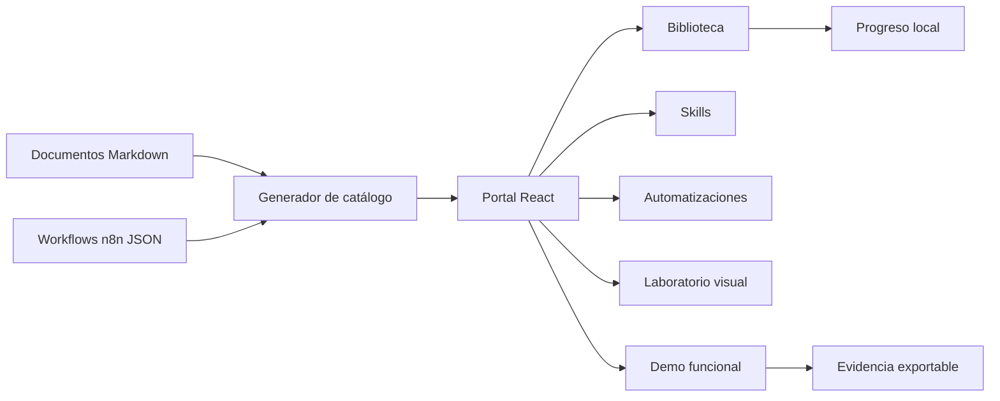
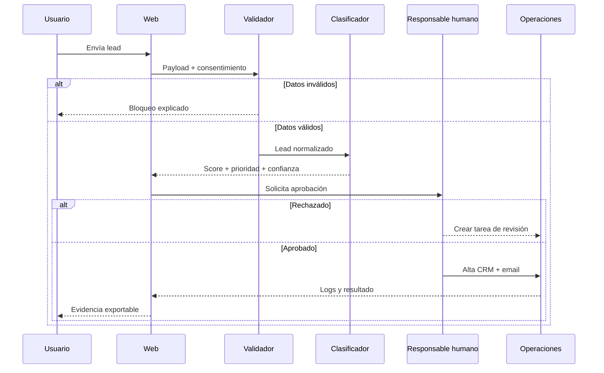
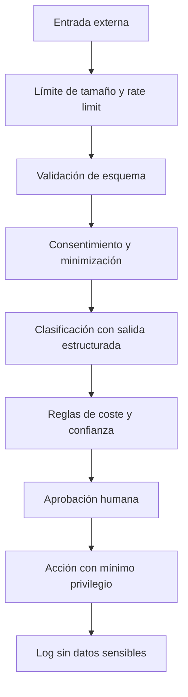

# Arquitectura visual y demo funcional

## Mapa general del producto



El generador funciona como adaptador entre una bóveda orientada a escritura y una aplicación orientada a uso. De esta forma, la formación puede seguir editándose en Obsidian y el alumno puede consumirla con búsqueda, navegación y seguimiento.

## Secuencia de la demo



La puerta humana es una decisión de arquitectura, no una limitación. Los procesos con impacto comercial, económico, legal o reputacional no deberían ejecutar acciones externas únicamente porque un modelo generó una respuesta plausible.

## Contrato de datos propuesto

```json
{
  "lead": {
    "name": "Laura Martín",
    "email": "laura@ejemplo.es",
    "company": "Estudio Norte",
    "budget": 5000,
    "need": "Automatizar seguimiento comercial",
    "consent": true
  },
  "classification": {
    "score": 92,
    "priority": "high",
    "confidence": 0.91,
    "reasons": ["budget_fit", "clear_need", "company_identified"]
  },
  "decision": {
    "status": "approved",
    "reviewer": "sales-owner",
    "timestamp": "2026-08-18T10:00:00Z"
  }
}
```

En producción este contrato debe validarse antes y después del paso LLM. El modelo no decide el formato; el sistema define el formato y rechaza cualquier salida que no lo cumpla.

## Capas de seguridad



Cada capa responde a un fallo diferente. El rate limit evita abuso; el esquema evita datos inesperados; el consentimiento limita el tratamiento; la salida estructurada reduce ambigüedad; la aprobación controla impacto; el mínimo privilegio limita daños; y el log permite investigar.

## Conversión a n8n

El formulario puede llamar a un Webhook de n8n. El primer nodo Code normaliza el payload y devuelve un error `400` si faltan campos. Un nodo IF separa los casos sin consentimiento. El nodo LLM debe solicitar JSON estricto y validar el resultado. El paso de aprobación puede enviar un mensaje con enlaces firmados; el workflow espera el callback. Tras aprobar, nodos específicos escriben en CRM y preparan el email. La última rama siempre registra resultado, duración, coste, reintentos y causa de error.

La respuesta HTTP inicial no debe quedar esperando indefinidamente. Para procesos largos conviene responder `202 Accepted` con un identificador de ejecución y actualizar el estado de forma asíncrona.

## Métricas de la demo real

- Porcentaje de payloads válidos.
- Porcentaje de leads por prioridad.
- Tasa de aprobación humana.
- Tiempo medio hasta aprobar.
- Tasa de alta correcta en CRM.
- Tasa de entrega de emails.
- Coste LLM por lead.
- Reintentos y errores por integración.
- Falsos positivos detectados por comerciales.
- Conversión final de lead a oportunidad.

Una automatización no se considera buena porque “funciona”. Se considera buena cuando reduce tiempo o errores sin aumentar riesgos, y puede demostrarse con métricas antes y después.
